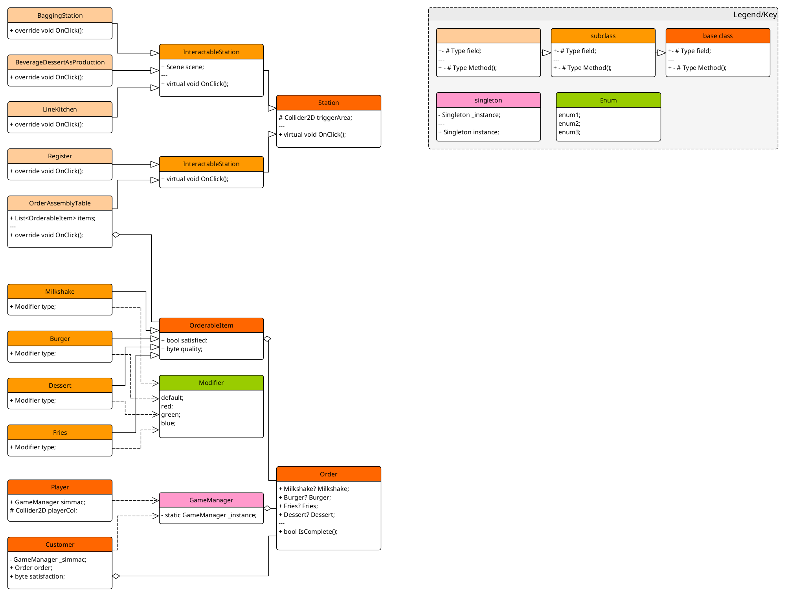
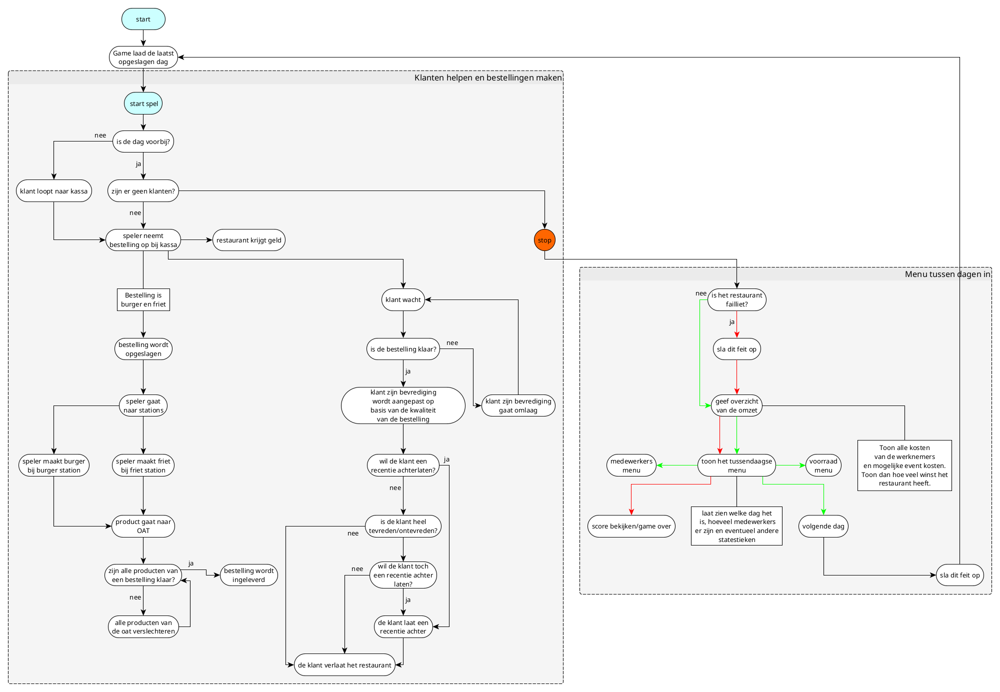

# Projectplan Prototype Simmac

## Contact gegevens van betrokken mensen

-   Nolan Bijmholt (Ontwikkelaar):
    -   Telefoon: +31623101156
    -   Email: nm.bijmholt@student.alfa-college.nl
-   Douwe Westerdijk (Ontwikkelaar):
    -   Telefoon: +31622177314
    -   Email: dh.westerdijk@student.alfa-college.nl
-   Rik Teerling (Klant)

## Versiebeheer

Het versiebeheer van dit project wordt gereld met Git en GitHub. Voor ieder nieuwe feature maken wij een branch op de git repository voor deze feature.

De github repository is te vinden met [deze link](https://github.com/Medikenji/Meesterproef), deze repository is privé en alleen toegangkelijk voor bevoegden. Als je geen toegang hebt en dit graag wil, stuur een email naar (een van) de ontwikkelaars.

## Software

Voor het ontwikkelen van Simmac maken wij gebruik van de Unity Game Engine versie 6000.0.40f1. Deze game engine is gekozen omdat wij het meeste ervaring hebben met Unity. Versie 6000.0.40f1 was de meest recente versie van Unity toen de ontwikkelfase van Simmac begon.

Microsoft Visual Studio Code wordt gebruikt als ontwikkelomgeving. Deze keuze is gemaakt omdat wij het fijner vinden om VSCode te gebruiken tegenover Visual Studio of JetBrains Rider.

Wij gebruiken ook VSCode om onze documentatie te maken en exporteren als PDF.

Voor versiebeheer hebben wij gekozen om GitHub te gebruiken i.p.v. GitLab, omdat wij ervarender zijn met GitHub.

Voor de klassendiagrammen en flowcharts gebruiken wij yEd. Dit is ook gekozen omdat wij bekender zijn met de workflow van yEd tegenover andere UML-design softwarepakketten zoals drawio.

## Planning

De planning wordt bijgehouden met google sheets in een stroken planning, deze is te vinden met [deze link](https://docs.google.com/spreadsheets/d/1UAxxr9gHdqxGKr9qrRfpPmZMmMEpT43-x3lhe_vaecc/edit?gid=0#gid=0), deze spreadsheets is privé en alleen toegangkelijk voor bevoegden. Als je geen toegang hebt en dit graag wil, stuur een email naar (een van) de ontwikkelaars.

## Folderstructuur

Alle bestanden die door de gebruiker zijn aangemaakt i.p.v. door Unity / VSCode zelf, worden opgeslagen in de Assets folder. Dit is de folderstructuur die wij gebruiken.

```
./Assets/
├── Plugins
├── Resources
│   ├── AchievementSprites
│   ├── Animations
│   ├── Player
│   ├── Sprites
│   └── Tilemap
├── Scenes
│   ├── GameScene
│   │   ├── Prefabs
│   │   └── Scripts
│   │       ├── Events
│   │       ├── Orders
│   │       └── Stations
│   ├── GlobalScripts
│   ├── Minigames
│   │   ├── BurgerStack
│   │   │   ├── Prefabs
│   │   │   ├── Scripts
│   │   │   └── Sprites
│   │   ├── PFIB
│   │   │   ├── Prefabs
│   │   │   ├── Scripts
│   │   │   └── Sprites
│   │   ├── ShakeShifter
│   │   │   ├── Prefabs
│   │   │   ├── Scripts
│   │   │   └── Sprites
│   │   └── SniperShowdown
│   │       ├── Prefabs
│   │       ├── Scripts
│   │       └── Sprites
│   └── UiScenes
│       └── Scripts
├── Settings
│   └── Scenes
├── Sprites
└── TextMesh Pro
    ├── Fonts
    ├── Resources
    │   ├── Fonts & Materials
    │   ├── Sprite Assets
    │   └── Style Sheets
    ├── Shaders
    └── Sprites
```

## Testplan

Gaan we samen bespreken.

## Taken

Dit zijn de taken die uitgevoerd moeten worden voor dit project, door wie deze taken uitgevoerd worden staat in de strokenplanning. Maar hier is een gedetaileerder overzicht.

- ### Documentatie
    - [x] Projectplan
    - [x] Voorstel
    - [x] GDD
    - [ ] Testplan
    - [ ] Technisch Ontwerp

- ### Features
    - [x] Stations
        - [x] Interactie met speler
        - [x] Opent scene
    - [ ] GameManager
        - [x] Class GameManager
        - [ ] Verbinden met stationen
        - [ ] Verbinden met klanten
        - [ ] Verbinden met UI.
    - [x] Movement
        - [x] Kan bewegen
        - [x] Sprite verandert als je van richting verandert
    - [x] Camera
        - [x] Speler volgen
        - [x] In en uitzoomen

- ### Testen
    - Baseer dit op het test plan

- ### Assets
    - [x] Tilemap
    - [x] Assets voor minigames

# Technisch ontwerp

- ### Klassendiagram


- ### Flowchart van de gameloop


# Links

- ### GitHub repository
https://github.com/Medikenji/Meesterproef

- ### Planning
https://docs.google.com/spreadsheets/d/1UAxxr9gHdqxGKr9qrRfpPmZMmMEpT43-x3lhe_vaecc/edit?usp=sharing
